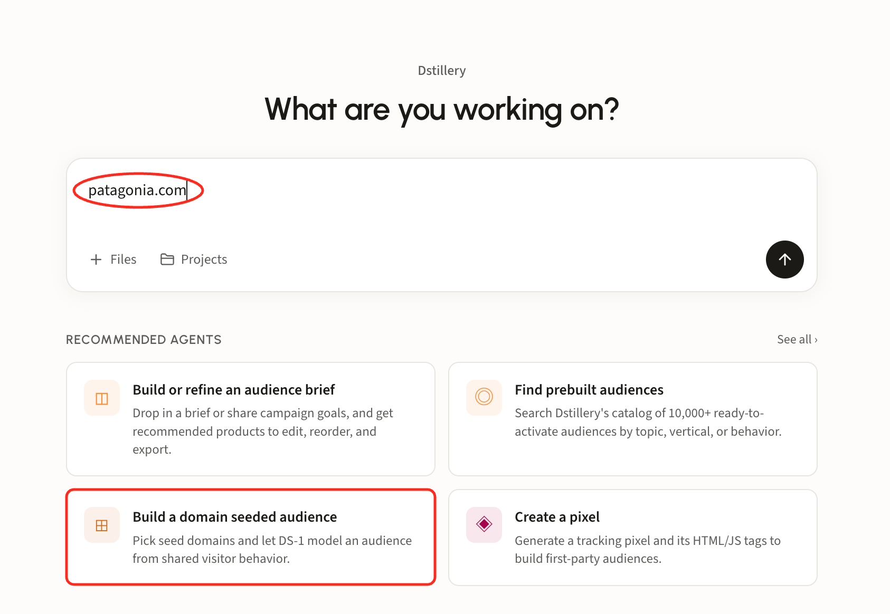
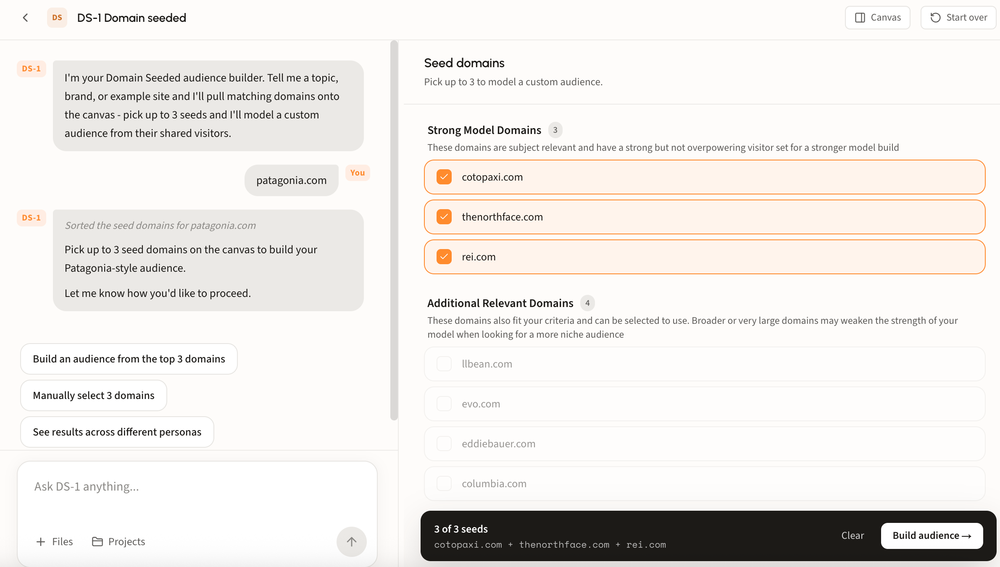
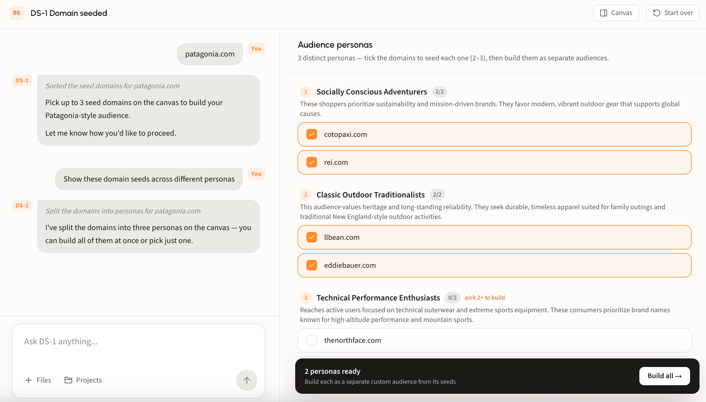
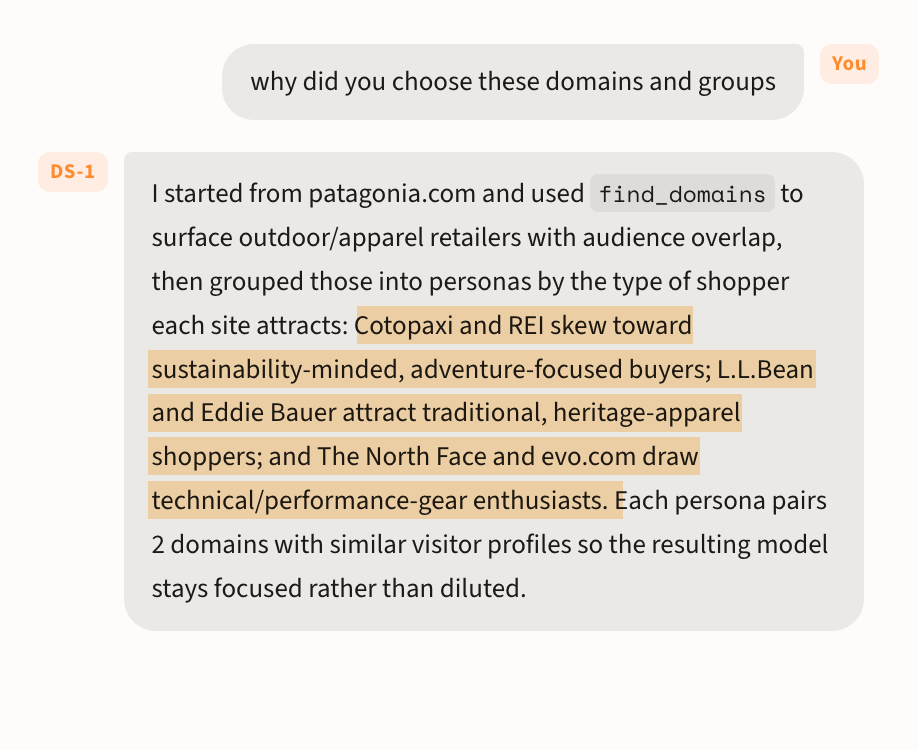
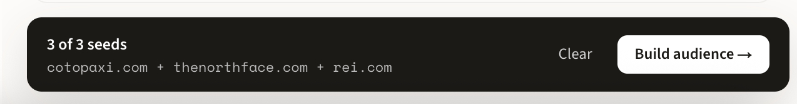
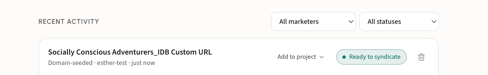
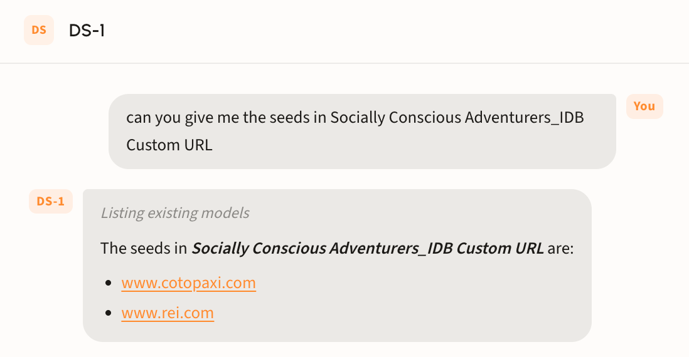

# Build a domain seeded audience

## When to seed from domains

Domain seeding starts from behavior rather than language. You name sites your customers already visit, and DS-1 models the people who visit them, then finds more people who look like that.

It is the right choice when the behavior is clearer than the vocabulary. Category enthusiasts often cluster on a handful of specialist sites without searching in any consistent way, and a competitor's or publisher's audience is easier to point at than to describe. When the campaign is better defined by *where people go* than by *what they type*, seed from domains.

## Walk through a build

### Step 1. Start from a domain

Type a domain straight into the chat box, or open **Build a domain seeded audience** under Recommended agents. Either route lands in the same place.

<figure><figcaption></figcaption></figure>

#### How DS-1 sorts the domains

Matching domains arrive on the canvas in two groups, and the distinction matters more than it looks:

* **Strong Model Domains** are subject relevant with a strong but not overpowering visitor set. That balance is what makes a sharp model: enough traffic to learn from, focused enough that the signal is not diluted.
* **Additional Relevant Domains** also fit the topic, but tend to be broader or much larger. A very large general-interest site brings in visitors who are there for everything else it publishes, which weakens the model when you are after a niche audience.

<figure><figcaption></figcaption></figure>

#### Split the seeds into personas

One brand rarely means one audience. Ask DS-1 to **show these domain seeds across different personas** and it regroups the same domains into distinct customer types, each with its own rationale and its own seed set.

<figure><figcaption></figcaption></figure>

Each persona needs **2 to 3 seeds** before it can build; the counter beside its name tracks that, and any persona short of two is flagged. Tick and untick domains to move the definition around, then **Build all** to create each persona as a separate custom audience, or build just the one you want.

This is the fastest way to split a brand's audience for testing: three personas from one domain, each modeled and syndicated separately, so creative and budget can vary by group.

#### Ask why

The grouping is not a black box. Ask DS-1 **why did you choose these domains and groups** and it explains its reasoning: which tool it ran, what it matched on, and why each pair of domains sits together.

<figure><figcaption></figcaption></figure>


DS-1 names which domains landed in which persona and why. Read it against your own understanding of the category, and if a pairing looks wrong, reseed before building rather than after.


### Step 2. Build and track it

Rename the audience if your team uses its own convention, then build. The bar at the bottom lists the seeds it will model from, with **Build audience** as the last click.

<figure><figcaption></figcaption></figure>

Builds land on the home page under **Recent Activity**.

<figure><figcaption></figcaption></figure>

### Step 3. Syndicate

Syndicate from that row, choose a reach size, and the audience goes to your seat. For more details regarding this flow, see [Build and activate to a DSP or SSP](../../ds-1-foundations/core-use-cases/build-and-activate-to-a-dsp-or-ssp.md).

## Looking up an audience's seeds

Ask DS-1 by name, for example *what seeds went into Socially Conscious Adventurers_IDB Custom URL*, and it returns the domains that audience was modeled from.

<figure><figcaption></figcaption></figure>

Useful when you are auditing a live segment or deciding what to change before syndicating.


Seeds cannot be changed once an audience lands in the DSP. Ensure every edit happens before you syndicate; after that, building a new audience is recommended.

