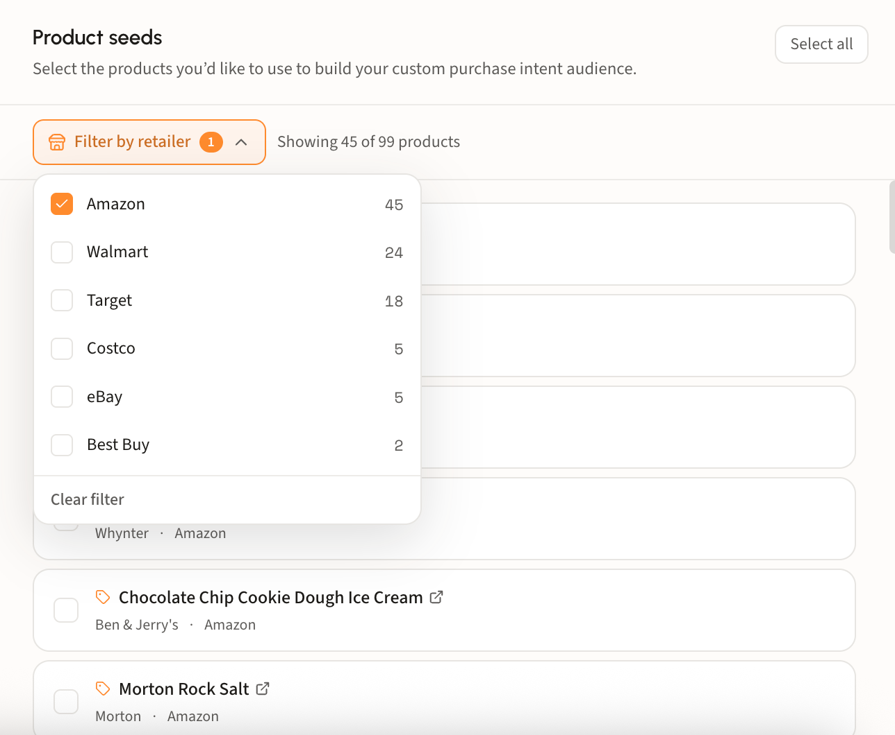
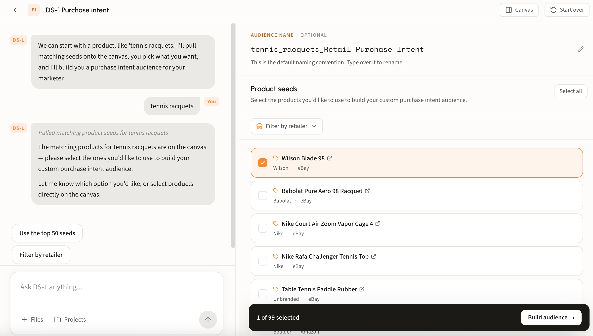

# Build a purchase intent audience

## When to seed from products

Purchase intent starts from what people are shopping for right now. You name the products, and DS-1 models the users browsing and researching them across retail sites, then finds more people showing the same behavior.

It fits three situations in particular:

* **Competitive retail conquesting.** Reach users actively visiting a competitor's product pages and intercept in-market buyers before they convert.
* **Seasonal pushes and product launches.** Timing is the whole campaign, and active shopping behavior is the freshest signal available.
* **Retail and CPG brands without first-party data.** Target active shoppers in your category when you have no customer file to model from.

Seed from domains when the behavior is clearer than the vocabulary, from search when the vocabulary is the behavior, and from products when the shopping itself is the signal.

## Where the data comes from

Product seeds are grounded in two sources:

* **Retail partner data and behavioral activity.** Dstillery ingests specialized partner data across CPG, grocery, big box retail, and tech, combined with real-time digital behavior such as product page visits across retail sites.
* **Opted-in panel data.** A fully consented panel of roughly 2 million users gives a ground-level, full-funnel view of how consumers research and buy.

## Walk through a build

### Step 1. Name a product

Type the product, brand, or category into the chat box, or open the retail purchase intent agent under Recommended agents. DS-1 returns matching product seeds, each with its brand and retailer.

### Step 2. Choose your product seeds

Tick the products that match the campaign. Two controls make a long list manageable:

* **Filter by retailer** narrows the list to one or more retailers, each showing its product count, with the header tracking how many of the total are in view. Use it when the campaign is retailer-specific, for example a Target endcap push or an Amazon launch. **Clear filter** returns the full set.
* **Select all** takes everything currently shown at once. Good for broad category coverage; skip it when only some of the products are genuinely on-brief.

<figure><figcaption></figcaption></figure>


DS-1 scans panel data for up to 200 candidate seeds per category, then Gen AI and manual review rank them down to the highest-indexing set. Keep your final selection tight for the same reason: one broad brand or product can dominate and dilute the model.


<figure><figcaption></figcaption></figure>

### Step 3. Build and track it

Rename the audience if your team uses its own convention, then build. The default follows a naming convention like *tennis_racquets_Retail Purchase Intent*.

Builds land on the home page under **Recent Activity**.

### Step 4. Syndicate

Syndicate from that row, choose a reach size, and the audience goes to your seat. For more details regarding this flow, see [Build and activate to a DSP or SSP](../../ds-1-foundations/core-use-cases/build-and-activate-to-a-dsp-or-ssp.md).

## Looking up an audience's products

Ask DS-1 by name, for example *what products went into tennis_racquets_Retail Purchase Intent*, and it returns the product seeds that audience was modeled from.

Useful when you are auditing a live segment or deciding what to change before syndicating.


Product seeds cannot be changed once an audience lands in the DSP. Ensure every edit happens before you syndicate; after that, building a new audience is recommended.

