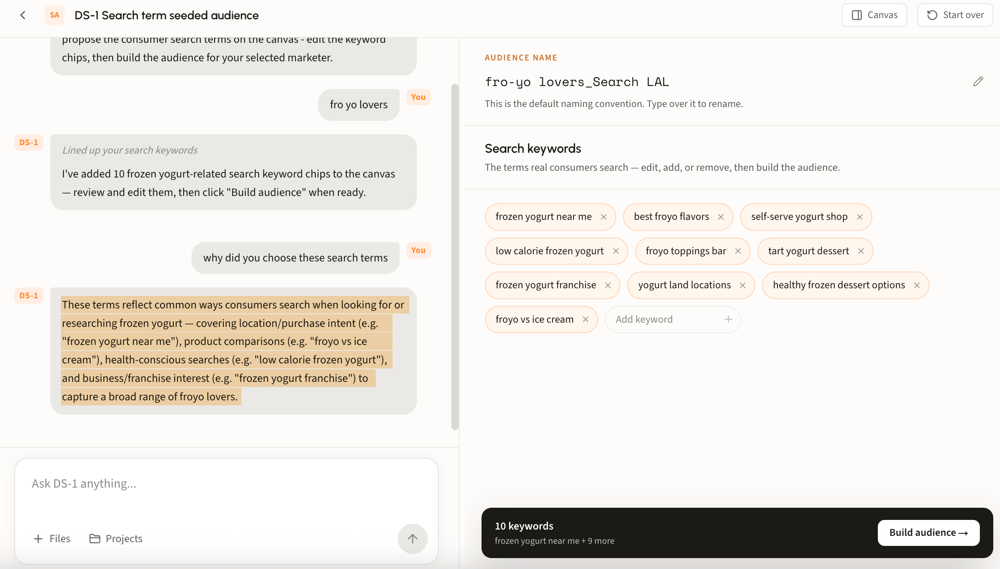
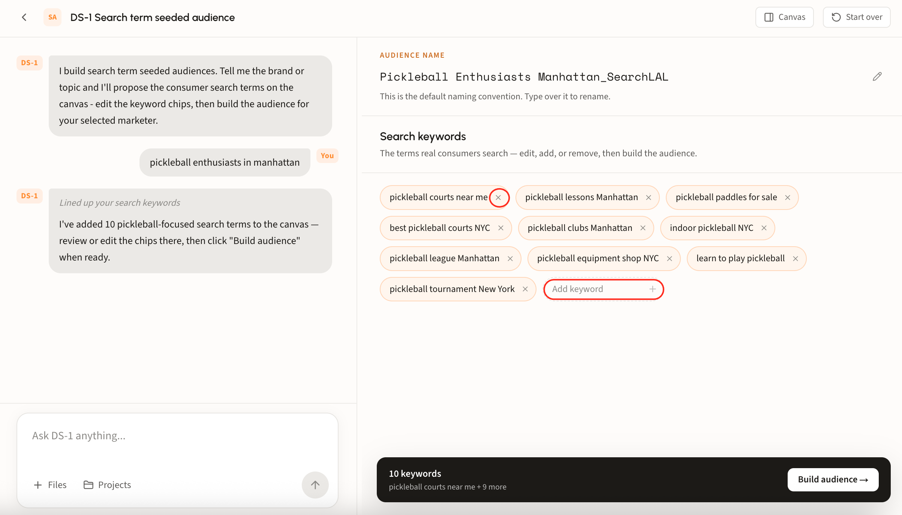

# Build a search LAL audience

## When to seed from search

Search LAL starts from what people type. You give DS-1 the terms that signal intent in your category, and it models the users behind those searches, then finds more people who look like them.

Two cases make it the obvious pick:

* **Extending paid search into programmatic.** The client is already buying search on Google or Bing and wants that same high-intent behavior carried across open web, video, and CTV. The keyword list already exists, so the audience is a short step from the search plan.
* **Conquesting without known URLs.** You want a competitor's customers but cannot name their domains, or the category is too fragmented to seed from sites. Search terms capture the intent without needing to know where it lands.

Seed from domains instead when the behavior is clearer than the vocabulary. Seed from search when the vocabulary is the behavior.

## Walk through a build

### Step 1. Start from a search term

Type your terms straight into the chat box, or open **Build a search lookalike audience** under Recommended agents. Either route lands in the same place.

#### Why DS-1 proposes the terms it does

DS-1 does not just accept your list. Proposals come from real search behavior, not guesswork, combining consented panel data with language models:

* **Opted-in panel behavior.** Roughly 2 million fully consented users give full-funnel visibility into actual Google queries, site visitation, and cross-site research journeys over time.
* **LLM behavioral mapping.** Language models read your request or brief and map the semantic relationships between search terms, product categories, and brand intent, turning a written concept into targetable signals.
* **Candidate pool and ranking.** An automated script mines the panel data for 300 to 500 candidate terms and sites, then Gen AI filters and ranks them to surface the highest-indexing, most closely related terms.

#### Ask why

The proposal is not a black box. Ask DS-1 **why did you choose these search terms** and it names the intent clusters behind the set, for example location and purchase intent, product comparisons, health-conscious searches, and business or franchise interest.

<figure><figcaption></figcaption></figure>

### Step 2. Shape the keyword set

Remove a term with its **×**, or use **Add keyword** for ones it missed. The count in the build bar tracks the set.

<figure><figcaption></figcaption></figure>

### Step 3. Build and track it

Rename the audience if your team uses its own convention, then build. The bar at the bottom lists the terms it will model from, with **Build audience** as the last click.

Builds land on the home page under **Recent Activity**.

### Step 4. Syndicate

Syndicate from that row, choose a reach size, and the audience goes to your seat. For more details regarding this flow, see [Build and activate to a DSP or SSP](../../ds-1-foundations/core-use-cases/build-and-activate-to-a-dsp-or-ssp.md).

## Looking up an audience's terms

Ask DS-1 by name, for example _what search terms went into Pickleball Enthusiasts Manhattan\_SearchLAL_, and it returns the terms that audience was modeled from.

Useful when you are auditing a live segment or deciding what to change before syndicating.


Search terms cannot be changed once an audience lands in the DSP. Ensure every edit happens before you syndicate; after that, building a new audience is recommended.

