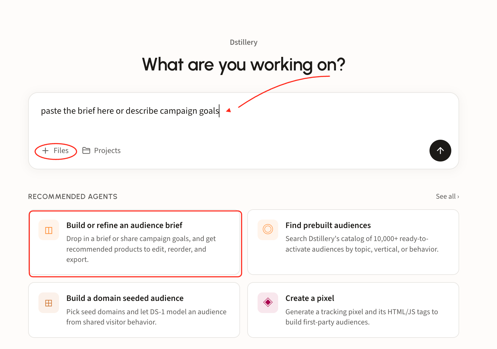
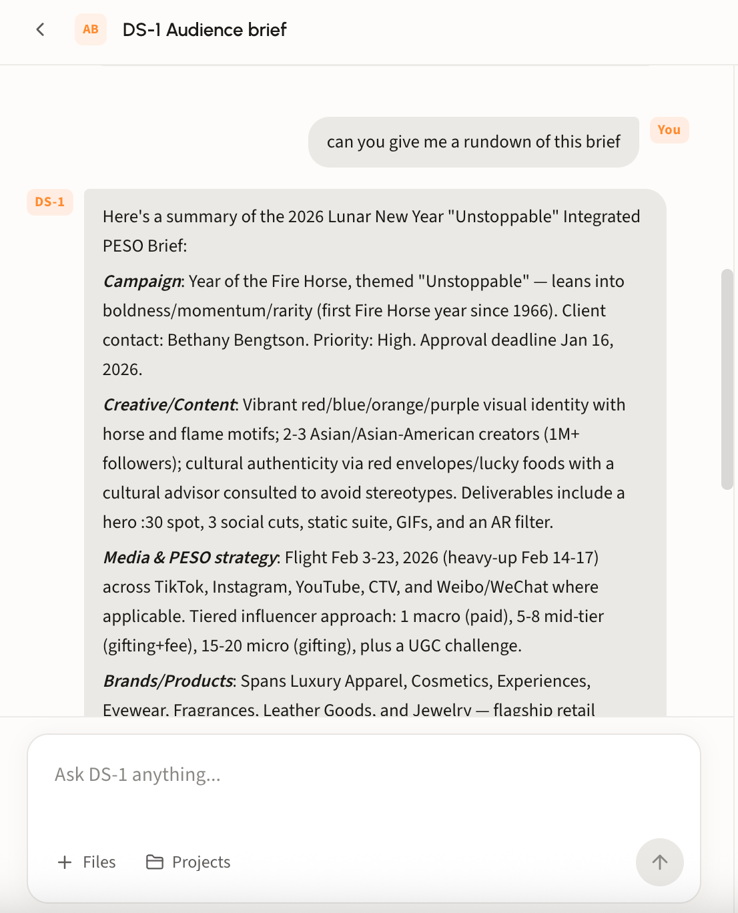
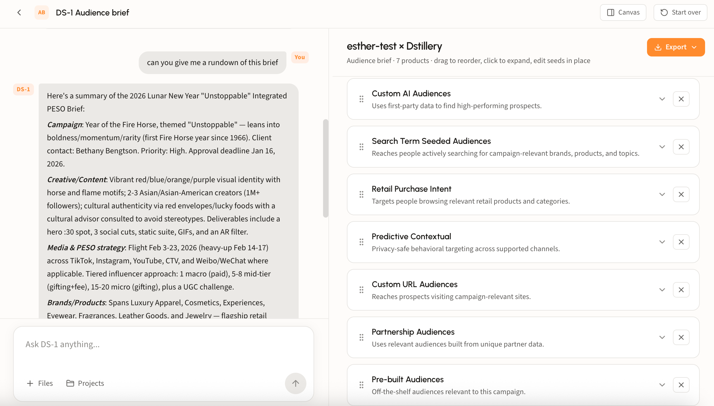
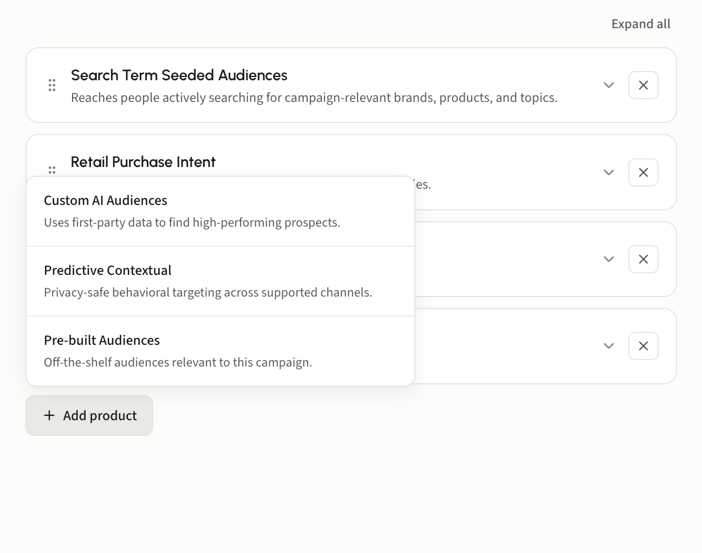
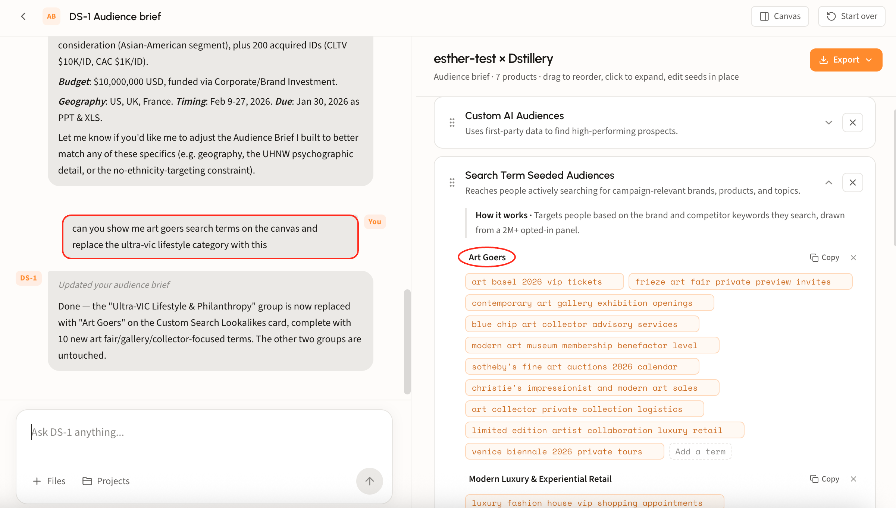
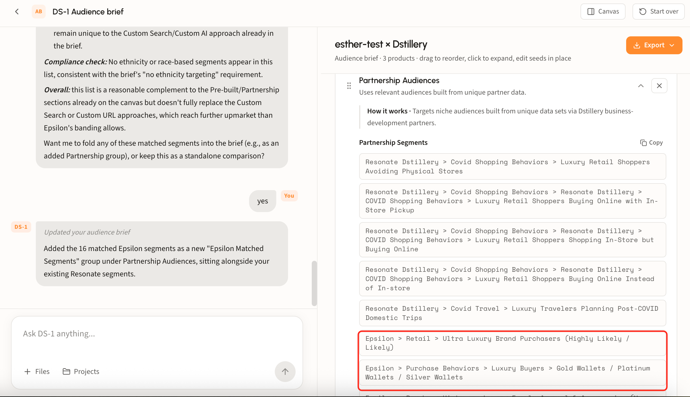

# Build or refine an audience brief

## What the brief agent does

Give DS-1 the campaign and it returns the audience strategy: which Dstillery products fit the objectives, and what each one should be built from. It reads the brief, matches it against the full product set, and assembles the recommendation on the canvas.

The output spans everything Dstillery can build for you, so the brief is a plan you can execute rather than a summary you have to interpret:

* Prebuilt audiences from the catalog
* Custom AI audiences
* Custom Search Lookalikes
* Predictive Contextual
* Custom URL audiences
* Your own audiences, when you upload a taxonomy

## Four ways to start

The agent does not require a formal document. Use whichever you have:

* **Upload a brief or RFP** with **Files**. Any format. DS-1 analyzes it and recommends against the stated objectives.
* **Paste the brief text** straight into the box, no file needed.
* **Describe the campaign in words.** A few sentences on goal, audience, and market is enough for a first pass.
* **Open the agent card.** **Build or refine an audience brief** under Recommended agents starts the same flow.

<figure><figcaption></figcaption></figure>

## Walk through a brief

### Step 1. Hand DS-1 the campaign

However you start, DS-1 reads the campaign before it recommends anything. Ask for **a rundown of this brief** and it summarizes what it picked up, section by section.

<figure><figcaption></figcaption></figure>

### Step 2. Review the recommendations

The brief lands on the canvas titled for the account. Each row is a recommended product with a one-line description of what it does.

<figure><figcaption></figcaption></figure>

### Step 3. Refine it

Nothing on the canvas is fixed. The brief is a draft you shape before anything gets built.

#### Edit on the canvas

* **Reorder** with the drag handle at the left of each row, to match how you present or prioritize.
* **Remove** a product with its **×** when it does not fit the plan or the budget.
* **Edit seeds in place.** Expand a recommendation and its seed groups are editable: remove a term with its **×**, use **Add a term** for ones it missed, or **Copy** a whole group out.
* **Add product** at the bottom of the list reopens anything you removed or adds a product DS-1 did not recommend.

<figure><figcaption></figcaption></figure>

#### Or just ask

Chat edits the canvas too, and it is faster for anything structural. Ask DS-1 to *show me art goers search terms on the canvas and replace the ultra-VIC lifestyle category with this*, and it swaps the group, generates the new terms, and confirms what changed while leaving everything else untouched.

<figure><figcaption></figcaption></figure>

#### Bring your own segment list

Upload your audience taxonomy and DS-1 matches it against the campaign, returning the segments from your own list that fit, plus an assessment of where they complement the brief and where they fall short of what a custom build would reach.

<figure><figcaption></figcaption></figure>

### Step 4. Build the set

When the brief looks right, say **build them all** and DS-1 builds every recommendation as its own audience, or name the ones you want and it builds only those. Either way it reports which segments went out and which are still modeling.

Builds land on the home page under **Recent Activity**. Syndicate from there; see [Build and activate to a DSP or SSP](../../ds-1-foundations/core-use-cases/build-and-activate-to-a-dsp-or-ssp.md) for reach sizes and destinations.


Working inside a project? The brief agent reads the project's attached files and instructions, so you do not have to re-upload the brief each session. See [Work in projects](../get-started/ds-1-overview/projects.md).

