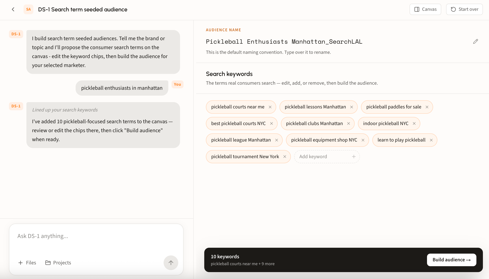
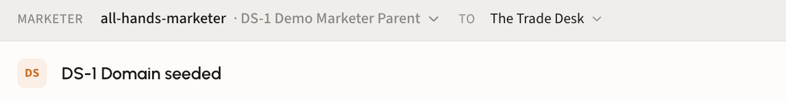
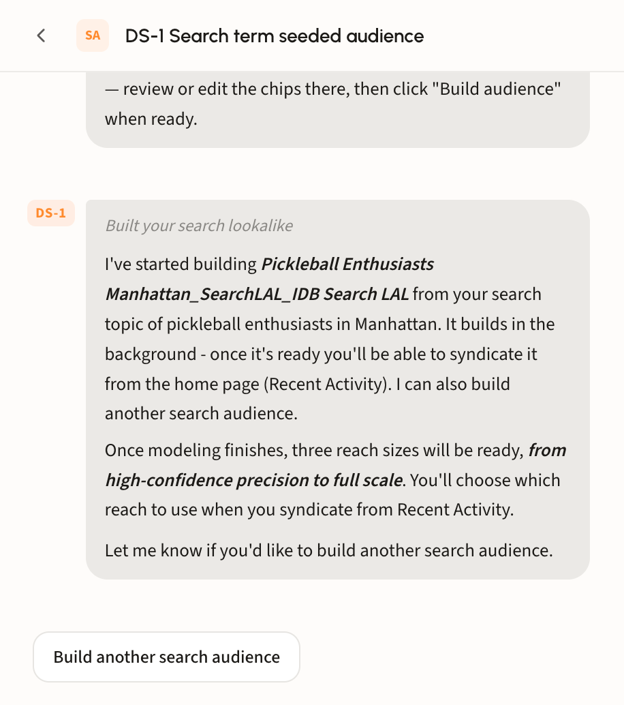
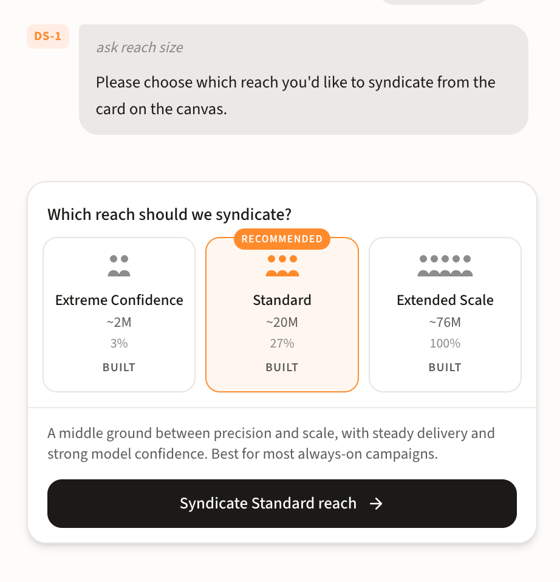
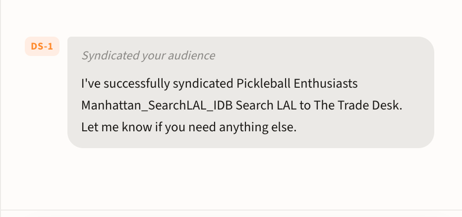

# Programmatic (DSPs / SSPs)

## Three ways to build

Finding an audience idea is easy. Turning it into something campaign-ready is the harder part. DS-1 covers both, and there is no export step between them.

There is no single build path, because the right one depends on what you are starting from:

* **Prebuilt.** Search Dstillery's catalog of 25,000+ off-the-shelf audiences. Fastest route when something proven already fits.
* **Custom.** Seed a new audience from domains, search terms, or retail products. Use this when you want a model built around your campaign's specific signals.
* **Custom AI.** Model from your own first-party data. Use this when the signal that matters is yours.

All three end the same way: activated in your seat, ready to target.


Not sure which path fits? Describe the campaign in chat and DS-1 will recommend across all three.


## Walk through a build

### Step 1. Describe what you are after

Name the brand, topic, or behavior in plain language. No perfect brief required. Here, _pickleball enthusiasts in manhattan_ is enough for DS-1 to propose ten consumer search terms on the canvas.

Depending on the agent you pick, that starting point can be search terms, retail or product signals, a domain or URL list, or a prebuilt audience you have already shortlisted.

### Step 2. Shape the seeds on the canvas

Whatever you seed from, the pattern is the same: DS-1 proposes on the canvas, you edit, then build. The bar at the bottom tracks your selection, and **Build audience** is always the last click.

You can also rename the audience at the top. The default follows a naming convention, like _Pickleball Enthusiasts Manhattan\_SearchLAL_ or _tennis\_racquets\_Retail Purchase Intent_. Type over it to match how your team labels segments in the seat.

#### Search terms

DS-1 proposes the terms real consumers search in your category. Remove a chip with its **×**, or use **Add keyword** for ones it missed. Drop terms that are only adjacent to your category, since they widen the audience without improving it.

<figure><figcaption></figcaption></figure>

#### Domains

Give a topic, brand, or example site and DS-1 pulls matching domains, modeling from their shared visitors. Pick up to three seeds, sorted into two groups:

* **Strong Model Domains** are subject relevant with a strong but not overpowering visitor set, which makes for a sharper model.
* **Additional Relevant Domains** also fit, but broad or very large domains can weaken the model when you are after a niche audience.

<figure><figcaption></figcaption></figure>

#### Retail products

Name a product and DS-1 pulls matching product seeds with their brand and retailer. Select the ones that match the campaign, use **Filter by retailer** to narrow a long list, or **Select all** to take the set.

<figure><figcaption></figcaption></figure>

### Step 3. Check the marketer to destination link

The top bar reads as one sentence: **marketer** _to_ **destination**. Confirm both before you build, since the segment lands in that specific seat and nowhere else. Change either from its dropdown.

The destination dropdown lists every platform set up for the marketer you have selected, so switching marketers changes the destinations on offer.

<figure><figcaption></figcaption></figure>

### Step 4. Build

DS-1 confirms the build and models in the background, so you are free to start another audience rather than wait on this one.

<figure><figcaption></figcaption></figure>

### Step 5. Track it in Recent Activity

Your audience appears on the home page under **Recent Activity**, tagged **Building** while it models. The row shows its type, marketer, and age, and filters by marketer or status when the list gets long. **Add to project** files it against an account from here.

<figure><figcaption></figcaption></figure>

Once the status clears, syndicate it from that row.

### Step 6. Choose a reach size

Before it goes out, DS-1 asks which reach to syndicate. Every build produces three, each already **BUILT** and showing its size and share of the full pool:

* **Extreme Confidence** is the tightest, highest-confidence slice. Use it when efficiency matters more than volume.
* **Standard** is the recommended middle ground: steady delivery with strong model confidence, and the right call for most always-on campaigns.
* **Extended Scale** is the full modeled pool, for reach-driven flights.

<figure><figcaption></figcaption></figure>

### Step 7. Confirm it went out

DS-1 confirms the syndication in chat, naming the audience and the platform it went to.

<figure><figcaption></figcaption></figure>

The Recent Activity row updates to match: the **Building** badge becomes **Done**, and the subline now reads _Syndicated to The Trade Desk_. That row is your record of where each audience went.

<figure><figcaption></figcaption></figure>

## Where you can activate

Activate to most major DSPs and SSPs, including The Trade Desk, DV360, Amazon, Yahoo DSP, Comcast, Adelphic, Cadent, Nexxen, Viant, StackAdapt, VideoAmp, Facebook, OpenX, Magnite, PubMatic, Index Exchange, Microsoft Curate, Equativ, and OneTag, plus dozens more through LiveRamp.


Segments appear in your seat on the destination platform's schedule. The Trade Desk, for example, typically takes 24 to 48 hours. Build with enough lead time before launch.

