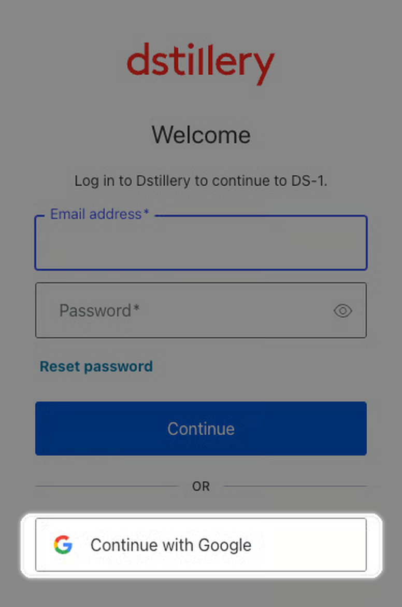
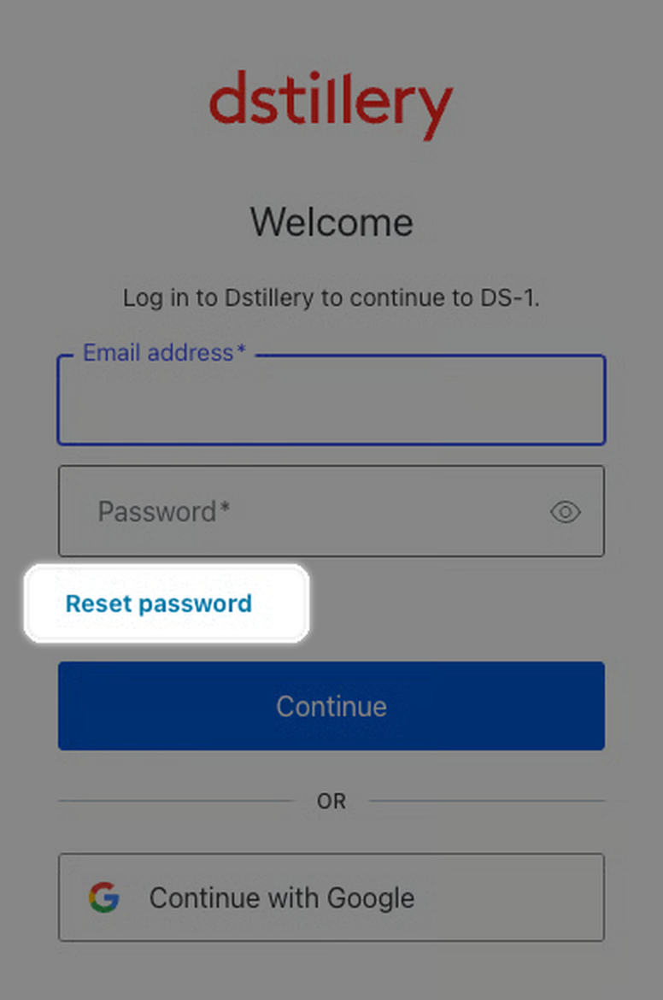
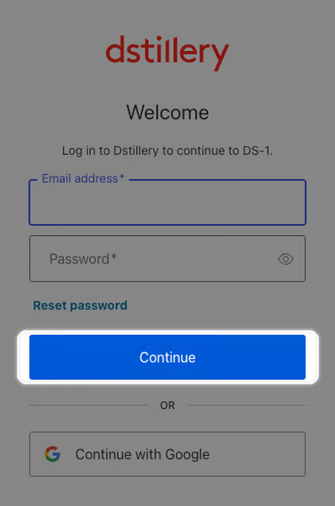

# Logging in to DS-1

### Log in to DS-1

Choose the sign-in method that matches your organization's email setup.


**Your outcome:** Access to DS-1 with your work email address.




**Open DS-1**

Go to [ds1.dstillery.com](https://ds1.dstillery.com).

<figure><figcaption>
The DS-1 login screen.
</figcaption></figure>



**Sign in**

Choose the option that matches your work email setup.

**Google-managed email**

1.  Select **Continue with Google**.

    <figure><figcaption>
Select <strong>Continue with Google</strong> if your organization uses Google-managed email.
</figcaption></figure>
2. Sign in with your work email address.

**Email and password sign-in**

1.  Select **Reset password**.

    <figure><figcaption>
Select <strong>Reset password</strong> to create a password.
</figcaption></figure>
2.  Enter your work email address and select **Continue**.

    <figure><figcaption>
Enter the email address for your DS-1 access.
</figcaption></figure>
3. Use the email instructions to create a password.



**Start using DS-1**

After creating your password, return to [ds1.dstillery.com](https://ds1.dstillery.com) and log in.


Use the work email address configured for DS-1. Check spam if the reset email does not arrive. Contact your Dstillery account team if you still need help.




**Next:** [Quick start](create-your-first-audience.md).
