# Projects

## What a project is

A project is a dedicated workspace inside DS-1. Everything you do in it stays in it: the files you upload, the audiences you build, the chat history. Nothing carries over into your main DS-1 session, and nothing from main DS-1 comes in.

That siloing is the point. One project per client, campaign, or pitch means you can open it three weeks later and DS-1 still has the context: the brief you uploaded, the segments you shortlisted, the insights you attached. You can also share a project with specific teammates, so the context travels with the work instead of living in one person's session.

## Why use one

* **Context that persists.** Upload a brief once and every agent in the project can read it. No re-explaining the campaign each session.
* **Clean separation.** Client A's files never surface while you're working on Client B.
* **Shared ground.** Invite the teammates on the account and they see the same files, audiences, and history you do.
* **Full DS-1 inside.** Projects are not a reduced mode. Everything you can do in main DS-1, including finding prebuilt audiences and building custom ones, works the same way in a project.

## Walk through a project

### Step 1. Open Projects

Click **Projects** in the left sidebar of DS-1.

<figure>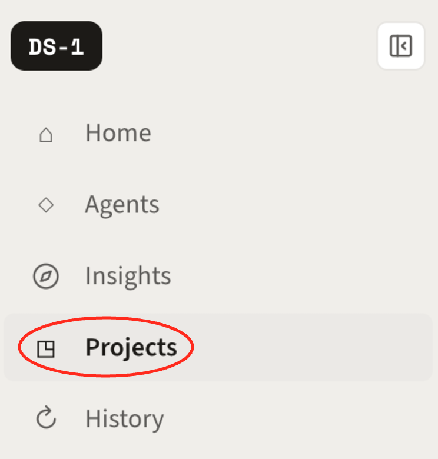<figcaption></figcaption></figure>

The Projects page splits into three tabs: **Your projects** for the ones you own, **Team** for your organization's, and **Shared with you** for projects a teammate added you to. Search by name, or sort by **Last updated** to get back to what you had open yesterday.

<figure>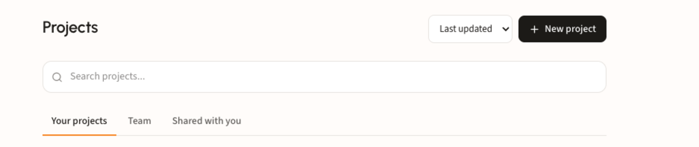<figcaption></figcaption></figure>

### Step 2. Create a project

The **New project** dialog asks for three things:

* **Project name.** Name it for the work it holds: the client, the campaign, or the pitch. A clear name is what makes the project findable later, so prefer _SafeGuard Q3 Auto Campaign_ over _new project_.
* **Description.** One line on what the project is for. Worth filling in when you're sharing with a team.
* **Project knowledge.** Attach context up front with **Upload files** or pull straight from **Drive**. You can also add files later, so don't wait on this to create the project.

<figure>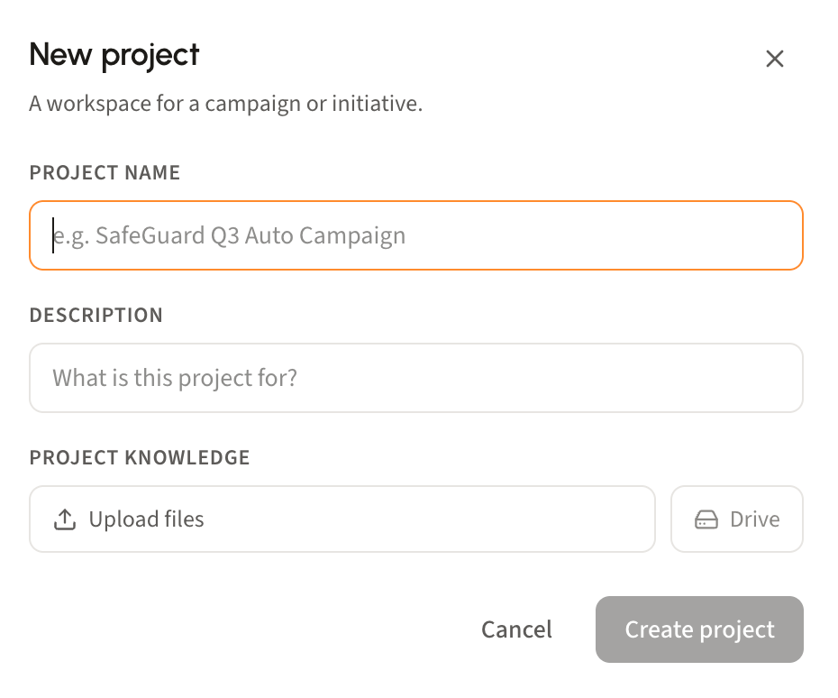<figcaption></figcaption></figure>

Click **Create project** and it opens, ready to work in.

### Step 3. Add your context

Whether you attached files at creation or not, you can keep building a project's knowledge as the work develops. The project panel holds four kinds of context, each with a **+** to add more:

* **Instructions.** Standing direction on tone and perspective, so you don't restate it every session. For example _use a more formal tone_ or _respond as the marketing team for Brand X_.
* **Files.** Briefs and RFPs for DS-1 to analyze and turn into an audience strategy.
* **Audiences.** Your own segment lists or audience taxonomy, so recommendations can point at what you already license.
* **Existing insights.** Insights you've already run in DS-1, attached as project knowledge rather than rebuilt.

<figure>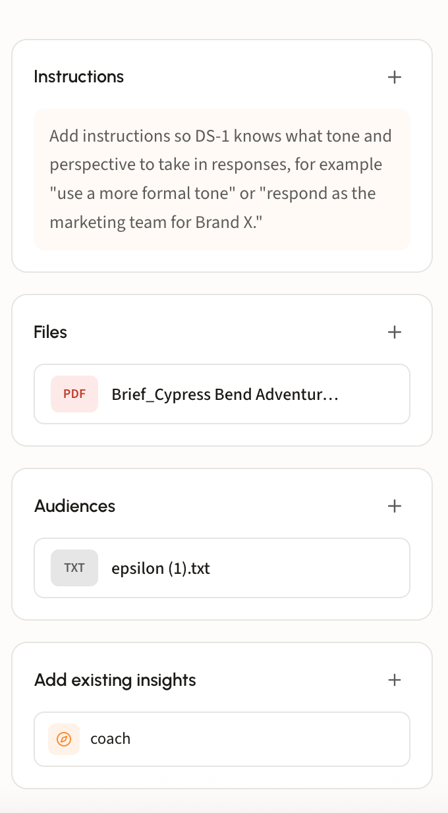<figcaption></figcaption></figure>

Anything in the panel is available to every agent you run in the project. The project chip sits in the composer, so DS-1 reads the file rather than asking you to retype the campaign each session. Ask for a rundown and you get the brief's goal, objectives, target audiences, geography, budget, and media mix back as a summary you can work from.

<figure>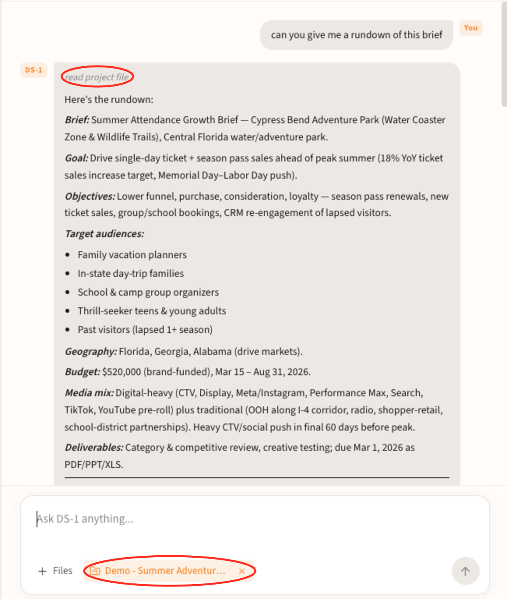<figcaption></figcaption></figure>

### Step 4. Share with your team

Open **Share** and search your organization by name or email. Anyone you add can use the project's chats, files, and audiences, and it shows up under their **Shared with you** tab. You set the level when you invite, so a reviewer can be **Can view** while a collaborator gets edit access.

<figure>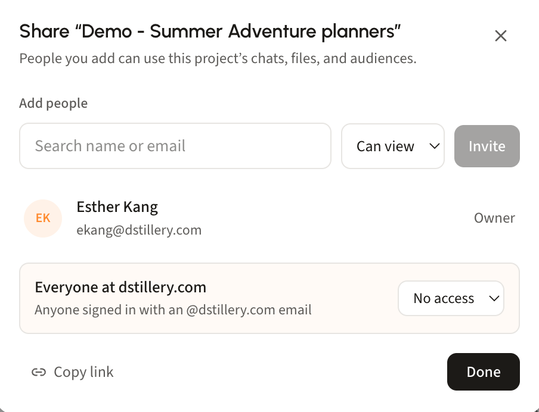<figcaption></figcaption></figure>

### Step 5. Build from the brief

Work exactly as you would in main DS-1, except the agents draw on the project's context instead of a prompt. Ask for product recommendations against the brief and DS-1 assembles an audience brief on the canvas, spanning the full product set: your own audiences, Custom AI, Custom Search Lookalikes, Predictive Contextual, Custom URL audiences, and prebuilt audiences.

<figure>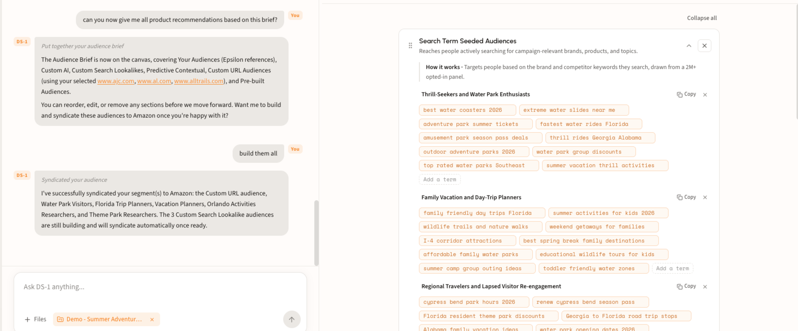<figcaption></figcaption></figure>

Review the canvas before committing. Reorder, edit, or remove sections, and on seeded audiences add or drop individual search terms. When it looks right, say **build them all** and DS-1 builds and syndicates the set to your destination platform, reporting back which segments went out and which are still building. Everything it produces stays filed under the project.


New to the audience agents? Start with [Find prebuilt audiences](agents/find-prebuilt-audiences.md), then run the same flow inside a project.


### Step 6. Map your own taxonomy

Upload your custom audience taxonomy and DS-1 adds a **Your Audiences** section to the brief: the segments from your own taxonomy that best fit the campaign objective, pulled out of a list that is usually far too long to hand-search. Here it surfaced the Epsilon nodes that match an amusement park campaign, across both transactional purchaser paths and lifestyle interest paths.

<figure>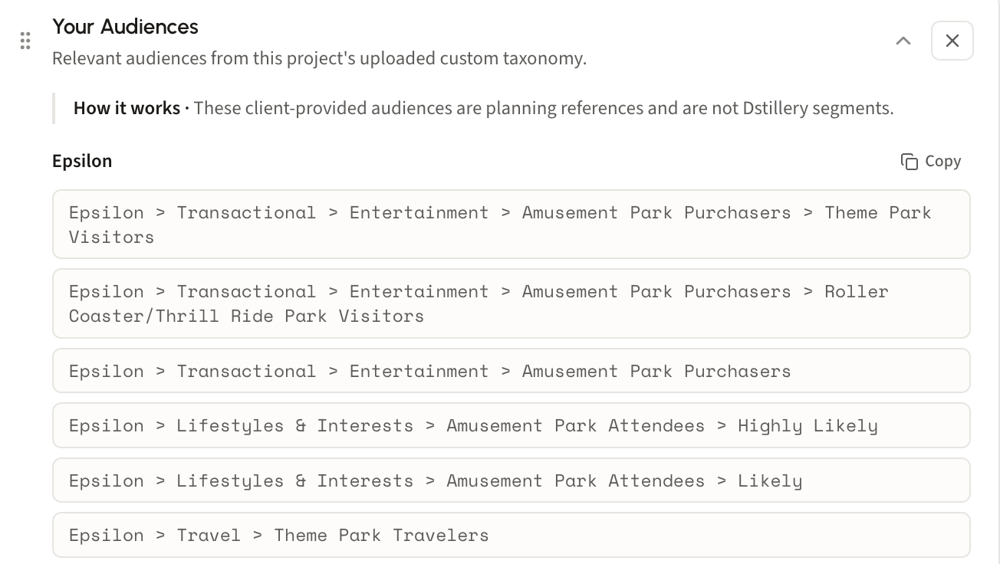<figcaption></figcaption></figure>

Use **Copy** to lift the full taxonomy paths straight into your DSP or planning doc.


These are client-provided planning references, not Dstillery segments. DS-1 matches them to the objective so you know what to activate on your side, but it does not build or syndicate them.


### Step 7. Pick the work back up

Every project keeps its own record, split in two:

* **Your chats** houses all the chats kicked off by you and by anyone who has shared the project with you, each with its opening question, who ran it, message count, and date. Click one to reopen the thread where you left it. Chats are private until shared, and a teammate's shared thread opens **read-only**, so you can follow their reasoning without changing it.
* **Activity** is the change log for the project itself: who updated the instructions, who added a file, and when. On a shared project it's how you catch up on what teammates changed since you were last in.

<figure>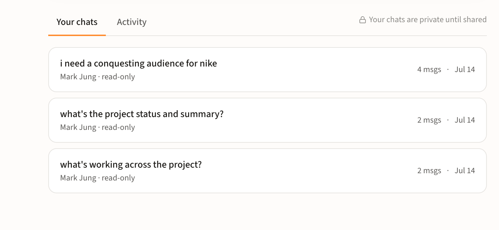<figcaption></figcaption></figure>

<figure>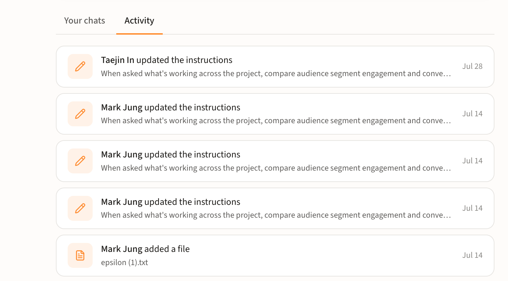<figcaption></figcaption></figure>

Because the record is per project, a client's history stays with that client. Reopening a thread from three weeks ago is how you revisit a segment mid-flight or rebuild a shortlist for the next flight without starting the brief over.

### Step 8. Pull an existing chat into a project

Work that started outside a project doesn't have to stay there. Open **History** in the left sidebar for every past conversation with DS-1, find the one you want, and use **Assign to project** to file it under any project you have.

<figure>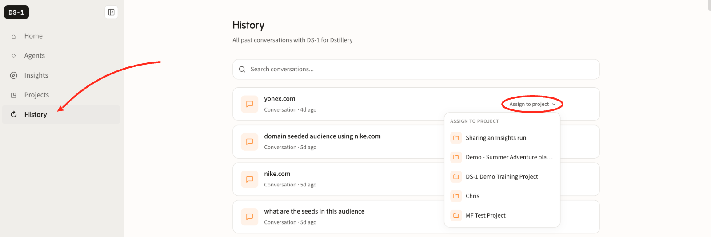<figcaption></figcaption></figure>


Assigned conversations join the project's context and record. Useful when something you explored ad hoc in main DS-1 turns out to belong with the account.

