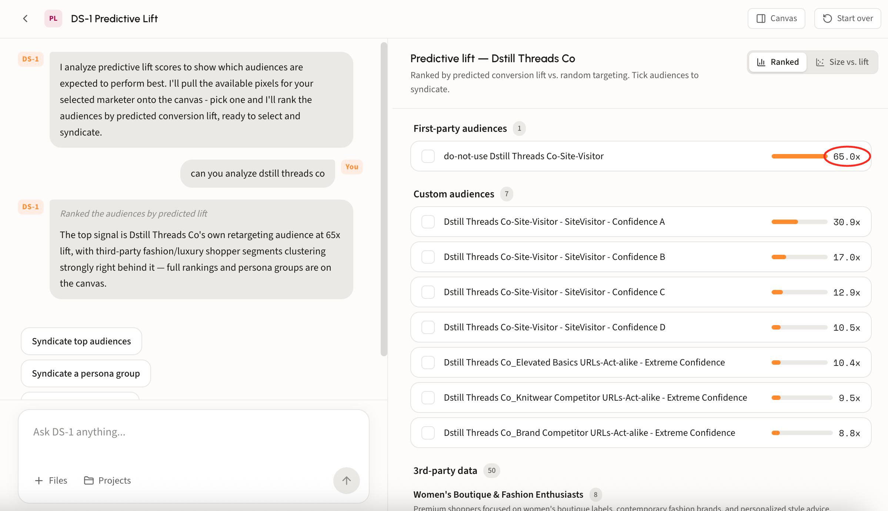
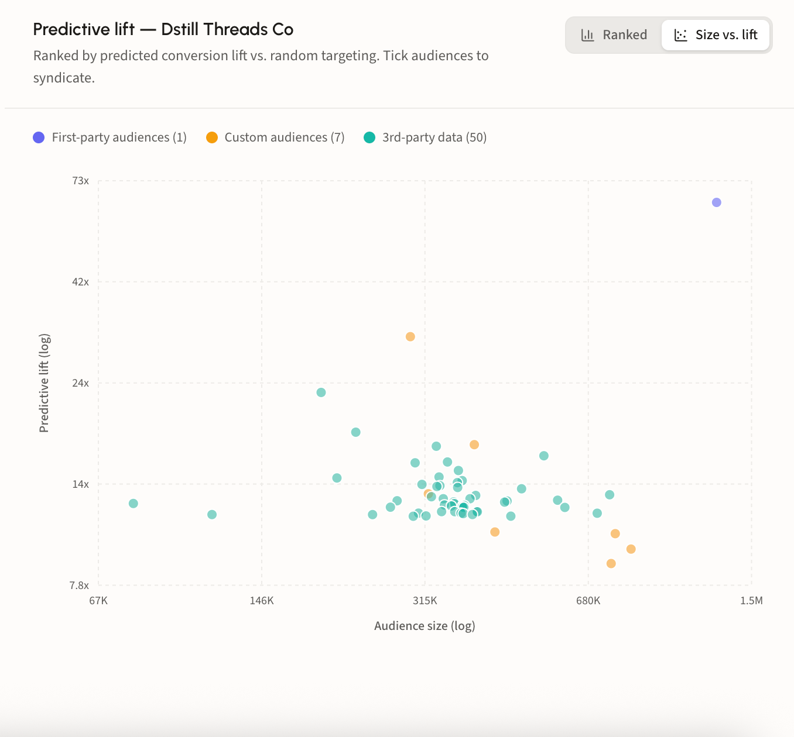

# Analyze predictive lift scores

## What a lift score tells you

A predictive lift score compares an audience against random targeting. It answers one question: how much better than chance is this audience expected to perform?

The higher the score, the stronger the expected performance. That makes lift the fastest way to rank options against each other, rather than guessing from audience names and reach numbers alone.

## When to use it

Use lift scores while you are still shaping the plan, before budget is committed. When a client or media planner wants to weigh several targeting ideas, lift turns the debate into a comparison: run the candidates, read the scores, and take the strongest into the brief.

It works across sources, so you can compare like for like:

* **Audiences you have already built**
* **Prebuilt audiences** from the catalog
* **Your pixel or first-party data**

## Walk through an analysis

### Step 1. Pick a pixel

DS-1 pulls the available pixels for your selected marketer onto the canvas. Pick one and it ranks the audiences by predicted conversion lift against that conversion signal.

### Step 2. Read the ranking

Results land grouped by source, each audience showing its lift as a bar and a multiple, for example **65.0x**. Grouping matters as much as the ranking: it tells you whether the strongest signal is your own data or something you would have to buy.

* **First-party audiences** built from your pixel
* **Custom audiences** modeled for this advertiser, including confidence tiers and act-alike variants
* **3rd-party data**, further grouped into named persona clusters

<figure><figcaption></figcaption></figure>

### Step 3. Check lift against size

Switch to **Size vs. lift** to plot every audience by reach against its score, a fuller picture than the lift numbers alone.

<figure><figcaption></figcaption></figure>

### Step 4. Select and syndicate

Tick the audiences you want and syndicate them, or use the suggestions in chat to send the top audiences or a whole persona group at once. See [Build and activate to a DSP or SSP](../get-started/activation/programmatic-dsps-ssps.md) for reach sizes and destinations.
