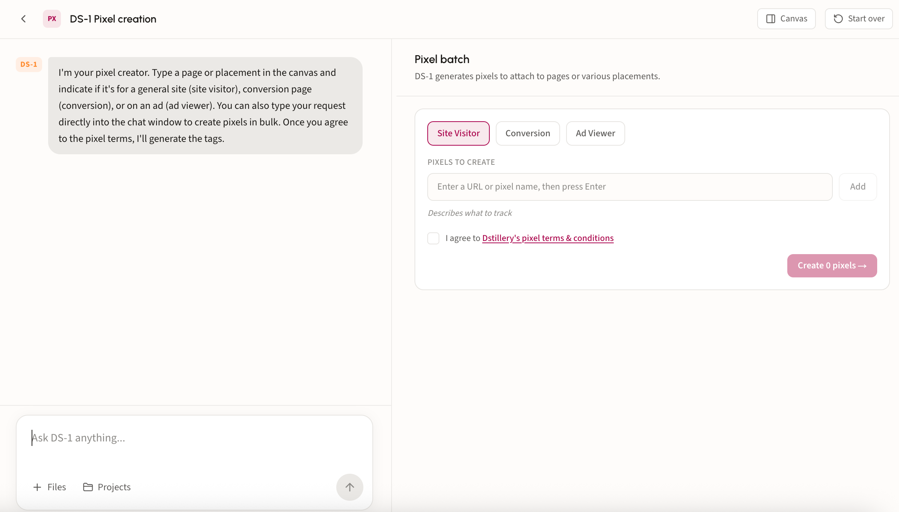
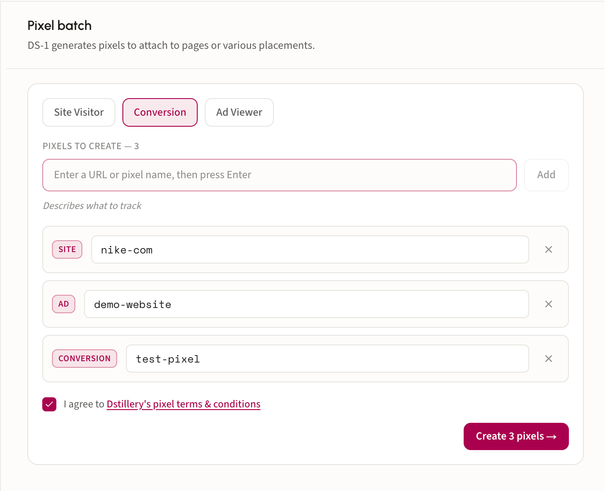
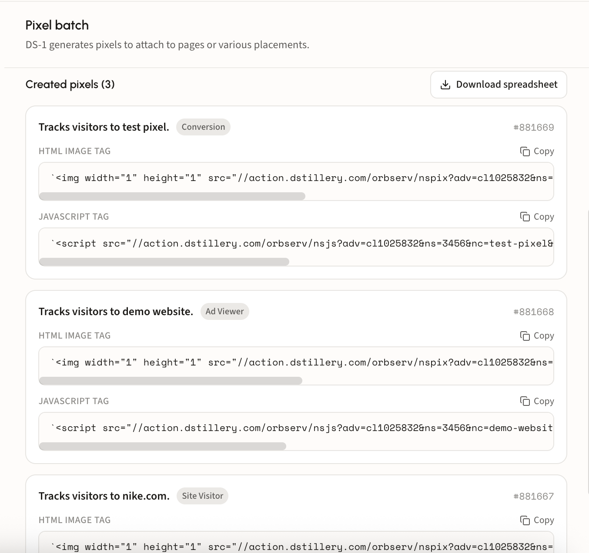

# 🎯 Create a pixel

## What a pixel does

A pixel is a tracking tag you place on the pages of your choosing. It records the visits to those pages, and that first-party data becomes the seed for Custom AI audiences modeled on the people who actually come to your site.

It is also what powers [predictive lift analysis](analyze-predictive-lift-scores.md), since lift is measured against a real conversion signal rather than a proxy.

## Walk through a pixel

### Step 1. Open the pixel creator

DS-1 opens with the **Pixel batch** panel on the canvas. Build the batch there, or type the request into chat to create pixels in bulk.

<figure><figcaption></figcaption></figure>

### Step 2. Pick a type and add pixels

Choose what the pixel tracks, then enter a URL or pixel name and press Enter. Each entry joins the list with a tag showing its type, so one batch can mix all three:

* **Site Visitor** for ordinary page visits.
* **Conversion** for pages that signal an action taken, such as a purchase or form submit.
* **Ad Viewer** for impression tracking.

Switch the type selector between entries to mix types in a single batch. Remove an entry with its **×**.

<figure><figcaption></figcaption></figure>

### Step 3. Accept the terms and create

Tick **I agree to Dstillery's pixel terms & conditions**. The create button counts your batch, for example **Create 3 pixels**, and stays inactive until the box is ticked.

### Step 4. Copy the tags onto your site

Each created pixel returns with its description, type, and ID, plus two tags: an **HTML image tag** and a **JavaScript tag**. Use **Copy** on whichever your site takes, and place it on the corresponding page.

<figure><figcaption></figcaption></figure>

**Download spreadsheet** exports the whole batch, which is the easier handoff when someone else is doing the tagging.


A pixel needs roughly **1,000 hits** before a Custom AI audience can be modeled from it. Place tags early, well before the campaign needs the audience.

