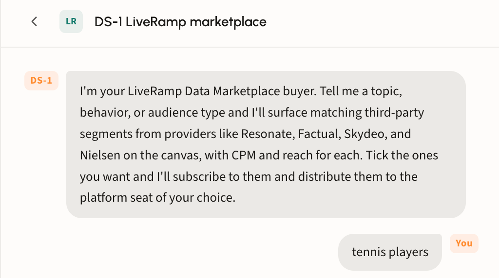
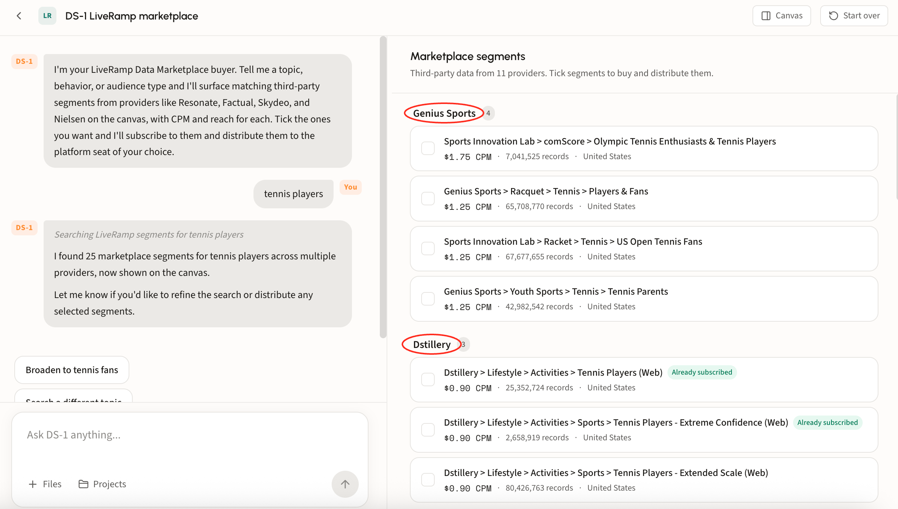
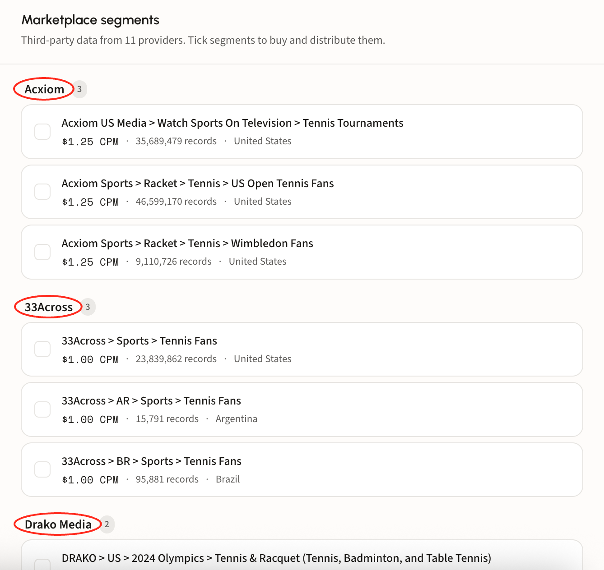
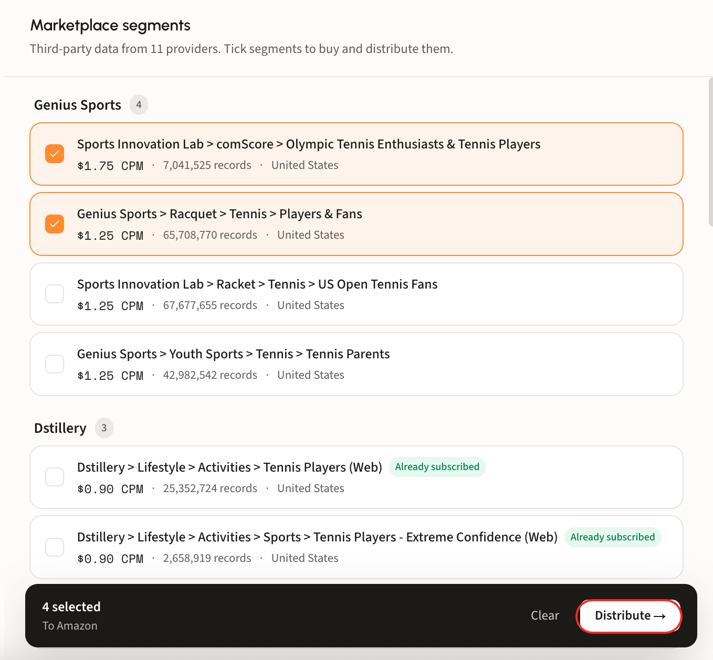

# LiveRamp Data Marketplace

## What the agent does

Search LiveRamp's data marketplace from inside DS-1. Describe what you are after and the agent surfaces matching third-party segments across the marketplace's many providers, so you can compare options and syndicate the ones you want without leaving the platform.

## Marketplace or partner audiences

Both search third-party data, but they are built and priced differently.

|                            | LiveRamp marketplace                                                                                              | [Dstillery partner audiences](partnership-audience-search.md)                                                                                            |
| -------------------------- | ----------------------------------------------------------------------------------------------------------------- | -------------------------------------------------------------------------------------------------------------------------------------------------------- |
| **How segments are built** | Single signals, static demographic lists, or declared survey data; matched on basic overlap or single-site visits | Sector-specific partner data layered into the multimodal AI engine and synthesized with browsing, search intent, and CTV viewership across 400M+ devices |
| **Refresh**                | Built once, refreshed weekly or monthly at best                                                                   | Rescored every 24 hours across 400M+ devices                                                                                                             |
| **Activation**             | Traditional syndication pipelines, which can add processing delay                                                 | User segments, curated PMP deals across 7 SSPs, custom bidding, predictive contextual, and social via LiveRamp                                           |
| **Pricing**                | Varies by data provider                                                                                           | 30% of media, capped at $2.50, or a $1.40 CPM                                                                                                            |

Use the marketplace for breadth: provider variety, niche categories, and segments you already buy elsewhere. Use partner audiences when modeled, current intent matters more than catalog size.

## Walk through a search

### Step 1. Describe what you are after

Give the agent a topic, behavior, or audience type in plain language, for example _tennis players_.

<figure><figcaption></figcaption></figure>

### Step 2. Review the segments

Matching segments land on the canvas under **Marketplace segments**, grouped by provider with a count beside each name. DS-1 reports the total it found in chat.

Every row carries the detail you need to compare like for like:

* **Full taxonomy path**, so you can see exactly where a segment sits in the provider's hierarchy.
* **CPM**, for cost comparison across providers.
* **Records**, the segment's size.
* **Country**, which matters when a provider lists the same segment per market.
* **Already subscribed**, flagged on segments you can use without buying again.

<figure><figcaption></figcaption></figure>

Scroll the canvas to compare across every provider in the result set.

<figure><figcaption></figcaption></figure>

Not quite right? Use the suggestion chips to broaden the search or start on a different topic, or chat with DS-1 to tailor the results.

### Step 3. Select and distribute

Tick the segments that fit the campaign. The bar at the bottom tracks the count and names the destination it will send to, with **Clear** to reset and **Distribute** to send.

<figure><figcaption></figcaption></figure>

DS-1 subscribes to the segments and distributes them to the platform seat you chose. See [Build and activate to a DSP or SSP](../get-started/activation/programmatic-dsps-ssps.md) for destinations and timing.
