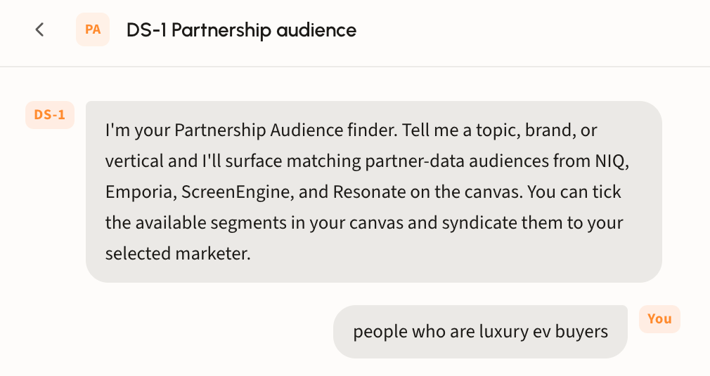
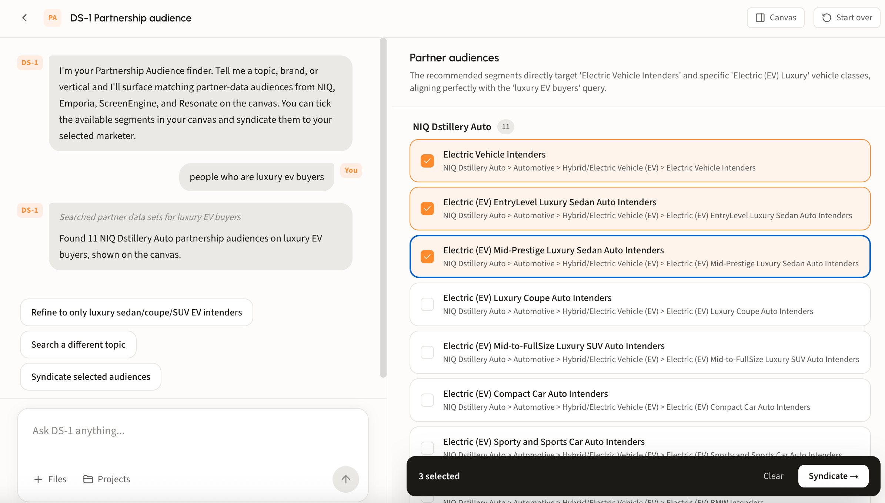
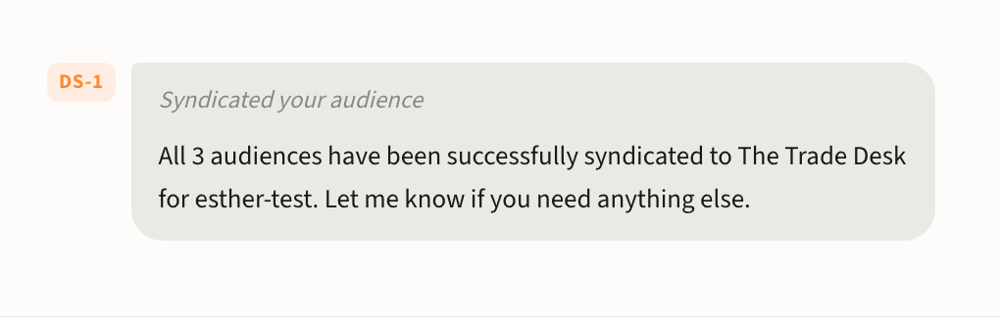

# Partnership Audience Search

## What the agent does

Tell DS-1 a topic, brand, or vertical and it surfaces matching partner-data audiences on the canvas. Tick the segments you want and syndicate them to your selected marketer, the same way you would any other audience.

It searches four partner catalogs:

* **NIQ**
* **Emporia**
* **ScreenEngine**
* **Resonate**

These are ready-to-activate partner segments. Search, select, syndicate.

## Why they perform

Partner audiences are not resold third-party lists. Dstillery takes sector-specific partner data spanning CPG, healthcare, B2B, and retail and layers it into its multimodal AI engine, synthesizing it with real-time browsing, search intent, and CTV viewership across 400M+ devices to form one predictive model of intent.

* **Rescored every 24 hours.** Every audience updates daily across 400M+ devices, so you are targeting behavior from yesterday rather than a profile built last quarter.
* **Activate any way you buy.** User segments, curated PMP deals across 7 SSPs, custom bidding algorithms, predictive contextual, or social platforms such as Meta via LiveRamp. Key activations are moving to direct S3 integrations, cutting middleman syndication wait times.
* **One pricing tier.** 30% of media, capped at $2.50, or a $1.40 CPM, rather than per-provider pricing that varies segment to segment.

Comparing against the open marketplace? See [LiveRamp data marketplace search](liveramp-data-marketplace.md).

## Walk through a search

### Step 1. Describe what you are after

Give the agent a topic, brand, or vertical in plain language, for example _people who are luxury EV buyers_. No taxonomy syntax required.

<figure><figcaption></figcaption></figure>

### Step 2. Review the matches

Matching segments land on the canvas grouped by partner dataset, with a count beside each group name. A line at the top explains why these segments matched your query.

Every row shows its full taxonomy path, so you can see exactly where a segment sits in the partner's hierarchy before selecting it.

<figure><figcaption></figcaption></figure>

Not quite right? Use the suggestion chips to refine the search or chat with DS-1 to tailor your results.


Do not forget to select your marketer and destination at the top before you syndicate.



### Step 3. Select and syndicate

Tick the segments that fit the campaign. The bar at the bottom tracks the count, with **Clear** to reset and **Syndicate** to send them to your selected marketer.

DS-1 confirms the handoff in chat, naming how many audiences went out and to which platform.

<figure><figcaption></figcaption></figure>

See [Build and activate to a DSP or SSP](../get-started/activation/programmatic-dsps-ssps.md) for destinations and timing.


Looking for Dstillery's own catalog instead? See [Find prebuilt audiences](find-prebuilt-audiences.md).

