# Insights

## What insights gives you

DS-1 insights is built on a comprehensive view of digital journey patterns, drawing on billions of data points to understand how audiences behave. Ask about any topic, brand, or domain and you get a profile of the people behind it: who they are, what predicts them, and where to reach them.

There are two entry points, and they run the same three reads:

* **General**: explore a topic, brand, or domain from the open web
* **First-party**: profile your own pixel audience once it clears 1,000 hits

The sections you get back are identical either way. The difference is whose behavior is being described: a category and the people behind it, or your actual visitors.

## When to use it

Use insights before the brief is written, when you are still deciding who to target and why. It is also the fastest way to answer a client question about an audience: a persona read, a competitive profile, a sanity check on an assumption, all without building anything first.

Common starting points:

* **A topic or category**, to understand a market you are new to
* **A brand or competitor**, to see who they attract
* **A domain**, to profile the visitors of a specific site
* **Your pixel**, to profile your own first-party data

## Walk through an insights run

### Step 1. Pick an entry point

Open **Insights** and choose how you want to start.

<figure>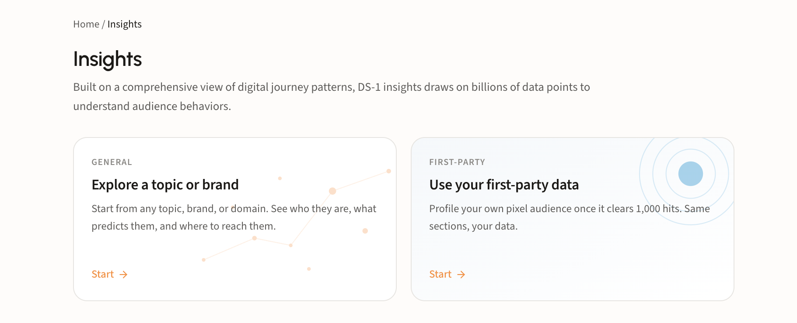<figcaption></figcaption></figure>

Take **Explore a topic or brand** to start from the open web. It accepts a plain-English topic, a brand name, or a URL, with no seed list or audience setup needed first. Take **Use your first-party data** to profile a pixel instead; skip to [Step 7](insights.md#step-7-profile-your-own-pixel).

### Step 2. Answer the navigator's questions

A broad query covers several different customers, so the Insights navigator asks before it researches. Name a topic like `matcha drinkers` and it comes back with the ways that audience splits.

<figure>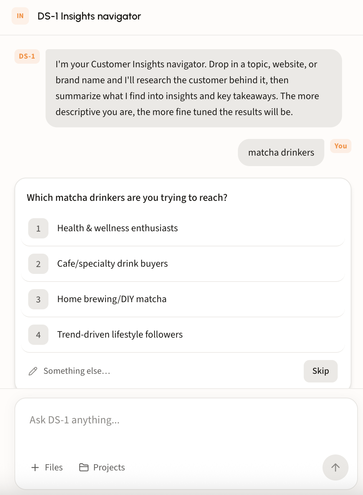<figcaption></figcaption></figure>

### Step 3. Confirm the topic and run

Once it has enough to go on, the navigator proposes the topic for the run: a written definition of the audience, including what it deliberately excludes.

<figure>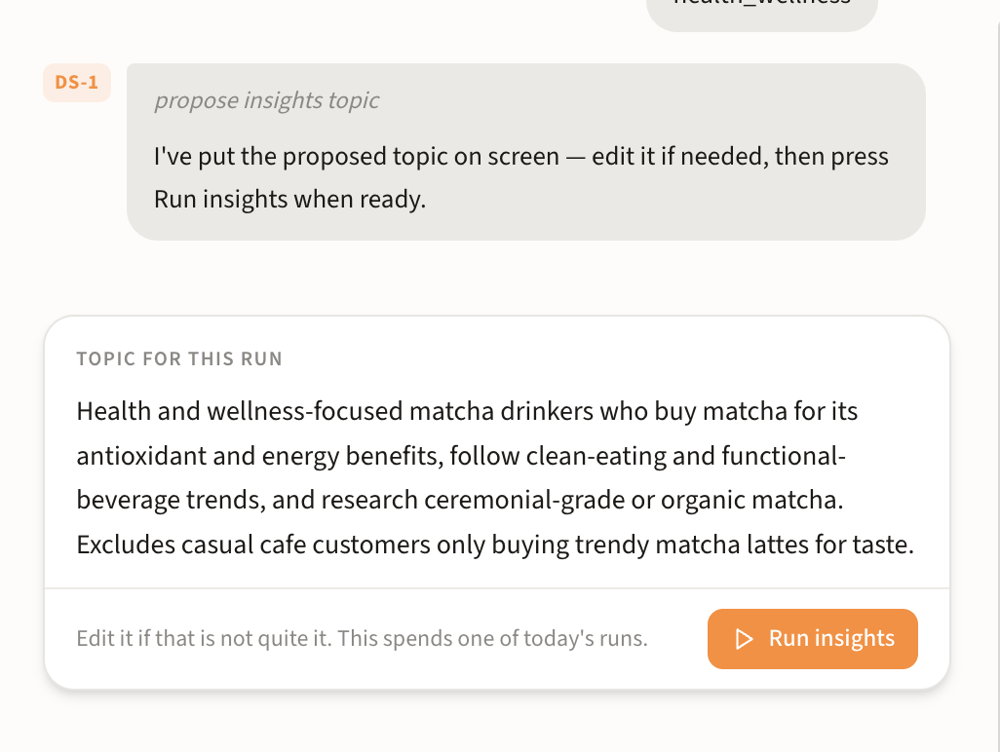<figcaption></figcaption></figure>

Edit the text if it is not quite right, then press **Run insights**.


Everyone gets 5 insights runs a day, so get the topic right before you run rather than after.


### Step 4. Read the interest themes

The report opens with **Interest themes**: the different reasons people come to this topic. Each theme carries its own set of audiences and its own index. Toggle between the themes it returns to see how the picture changes.

<figure>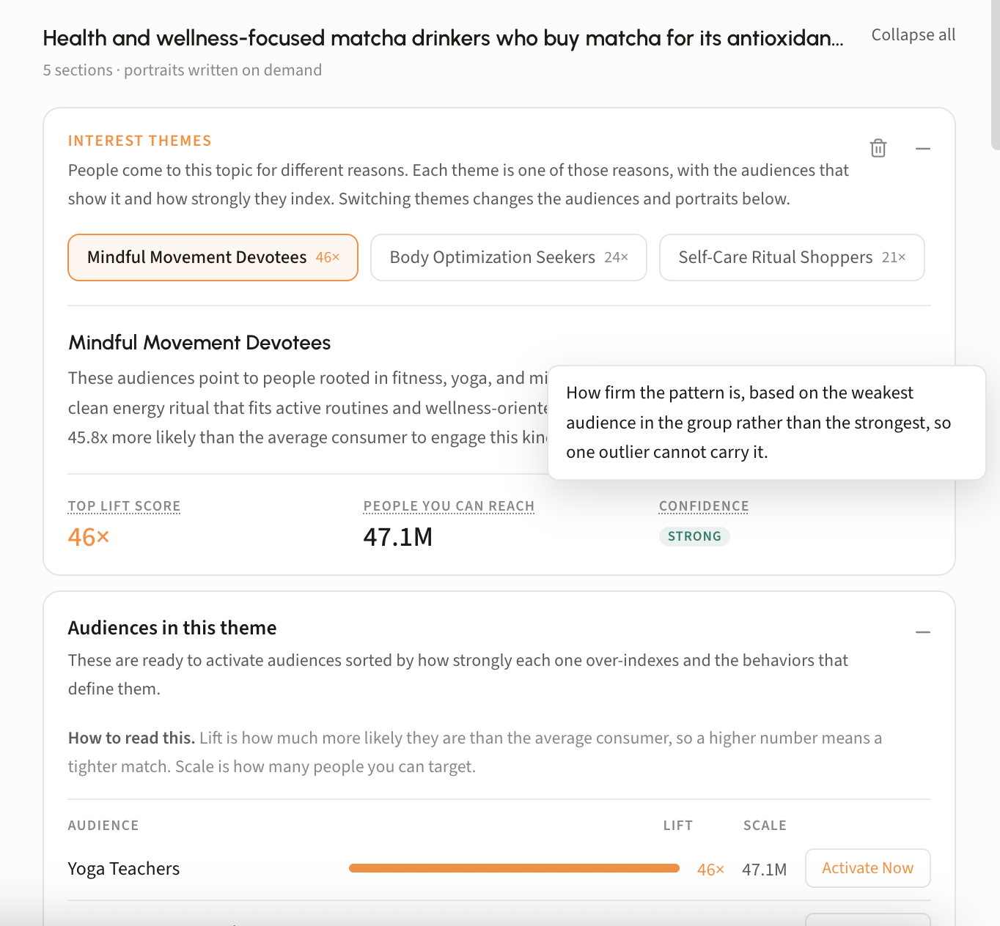<figcaption></figcaption></figure>

Under the selected theme is three metrics:

| Metric                   | What it means                                                                                                                 |
| ------------------------ | ----------------------------------------------------------------------------------------------------------------------------- |
| **Top lift score**       | How much more likely this group is to engage than the average consumer                                                        |
| **People you can reach** | The addressable scale of the theme                                                                                            |
| **Confidence**           | How firm the pattern is, based on the weakest audience in the group rather than the strongest, so one outlier cannot carry it |


Every metric label is defined in place. Hover it to see how it is calculated before you quote the number to a client.


### Step 5. Work the audiences in the theme

**Audiences in this theme** lists the ready-to-activate audiences behind the topic, sorted by how strongly each one over-indexes, with the behaviors that define it. Read the two columns together: **lift** is how much more likely the audience is than the average consumer, so a higher number means a tighter match, and **scale** is how many people you can actually target. The strongest lift is often the smallest audience.

<figure>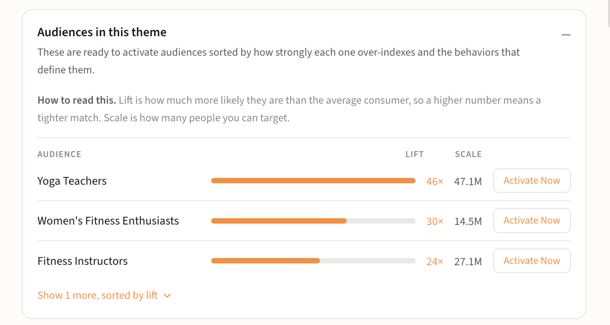<figcaption></figcaption></figure>

**Activate Now** on any row sends it straight into activation. See [Build and activate to a DSP or SSP](get-started/activation/programmatic-dsps-ssps.md) for destinations and reach sizes.

### Step 6. Read the rest of the report

Three more sections come back with every run.

**Content they consume** is where the theme spends attention, across every channel. Each channel expands into its own dimensions, and each signal carries a score.

<figure>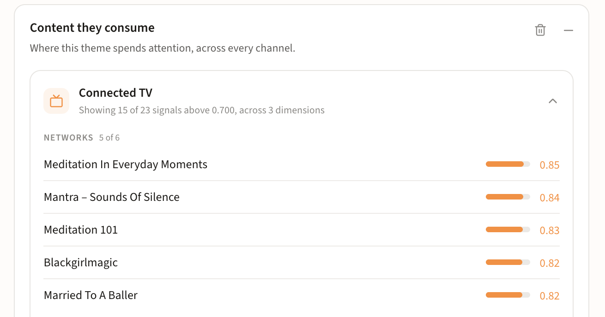<figcaption></figcaption></figure>

The subhead tells you how much is being shown and how much is being held back (_15 of 23 signals above 0.700, across 3 dimensions_), so a short list means a strict threshold, not a thin audience. Use this section for inventory and contextual planning alongside the audience itself.

**What they search** is real search behavior from this audience's best customers, grouped into topics and indexed against the average consumer. Index is how much more often these people search a topic than average; confidence is how firm the pattern is.

<figure>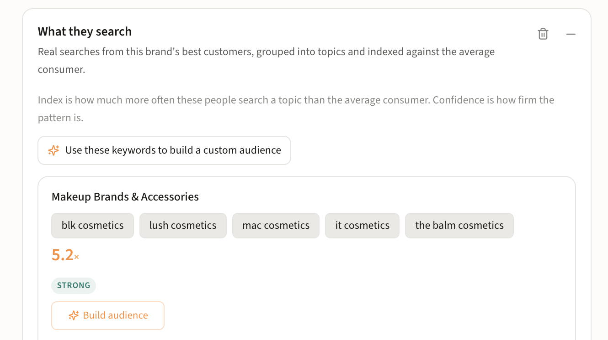<figcaption></figcaption></figure>

Each topic group shows the actual keywords behind it, so you can see whether the grouping holds up before you act on it. See [Build a search LAL audience](agents/build-a-search-term-seeded-audience.md) for what happens next.

**Key takeaways** sit in the left panel while the report fills the canvas: the topic you ran at the top, then the findings stated as claims with the numbers that back them. Each one is a headline plus the evidence: indexes, reach, and the specific audiences or searches behind it.

<figure>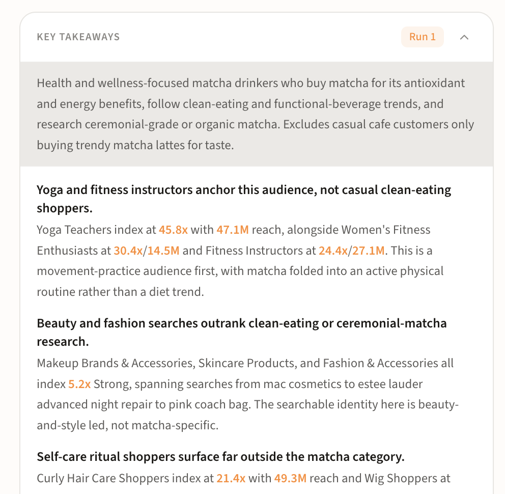<figcaption></figcaption></figure>

After the takeaways, look at the suggested next steps, or keep chatting with the agent to surface more.

<figure>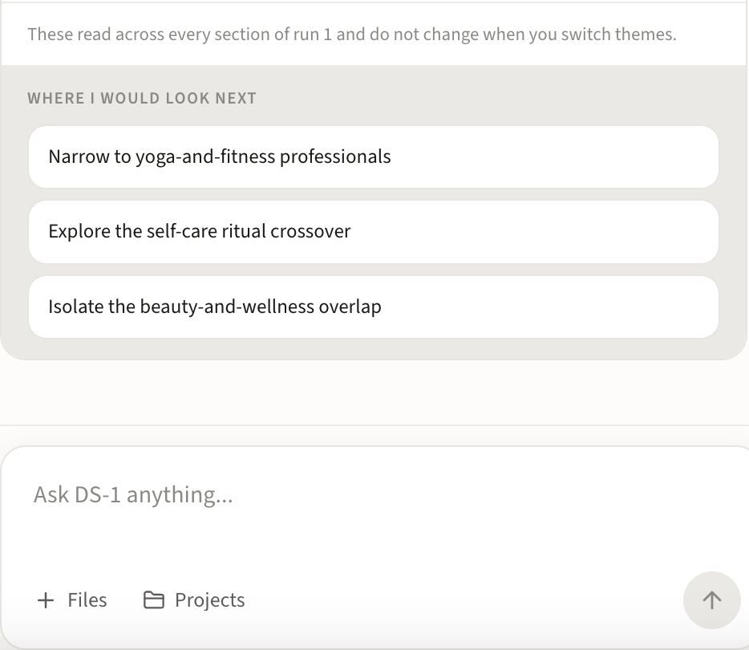<figcaption></figcaption></figure>

### Step 7. Profile your own pixel

**Use your first-party data** opens the pixel picker. First-party is pixel data for now, and every pixel with **1,000 or more hits** populates here, marked **Ready** with its hit count. Search by name or pick one from recent.

<figure>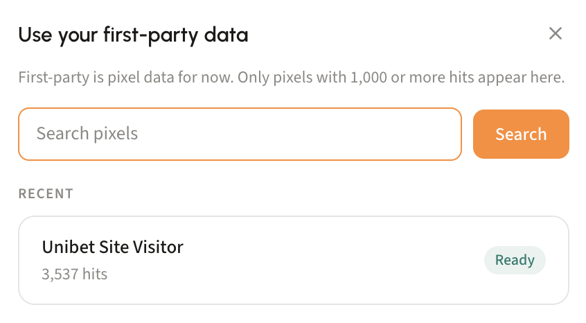<figcaption></figcaption></figure>

Pick a pixel and it opens in **Explore**, a set of views you toggle between in the left sidebar. See [Create a pixel](agents/create-a-pixel.md) if you do not have one collecting yet.

**Audience snapshot** is the starting view. **Audience composition** gives you the demographics of your visitors, gender and age, then the top five audiences they fall into across behavioral, predictive location, and website rankings. Click any of those cards to go deeper.

<figure>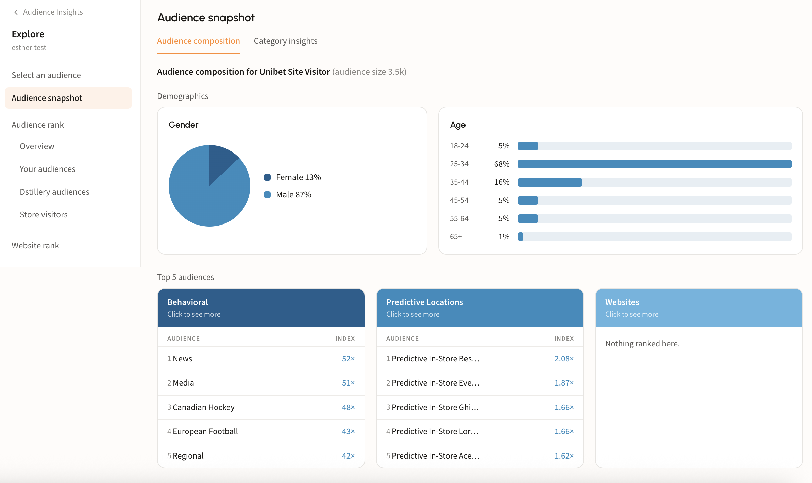<figcaption></figcaption></figure>

**Category insights**, the second tab of the snapshot, groups the behaviors your visitors over-index for into named categories, each card listing the audiences inside it and their index.

<figure>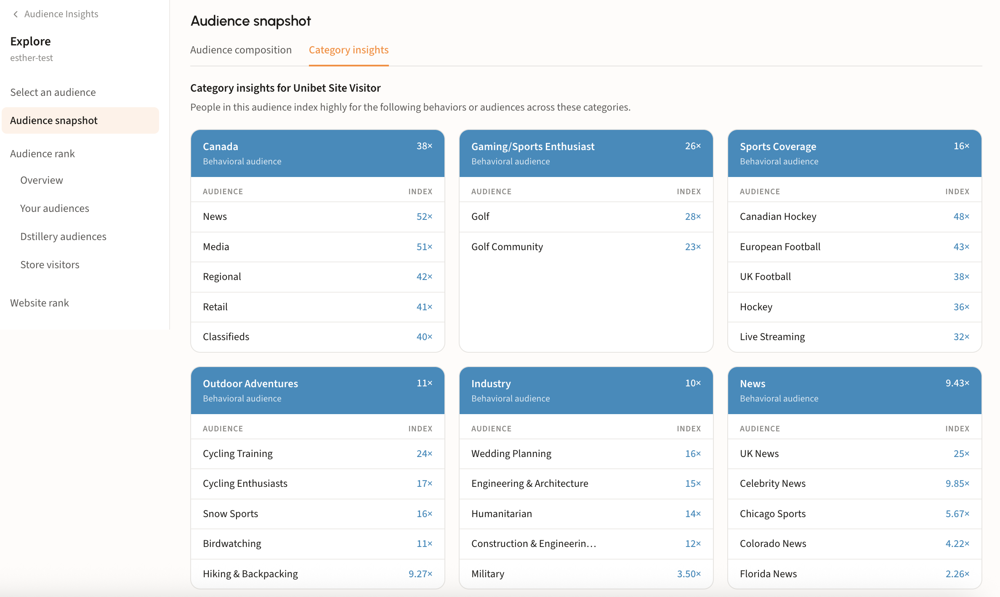<figcaption></figcaption></figure>

**Audience rank** is the full ranked list rather than the top five, split into **Your audiences**, **Dstillery audiences**, and **Store visitors**. Each row carries an index and a share, so you can see both how strongly your visitors over-index and how much of the audience it accounts for. **Website rank** does the same for domains.

<figure>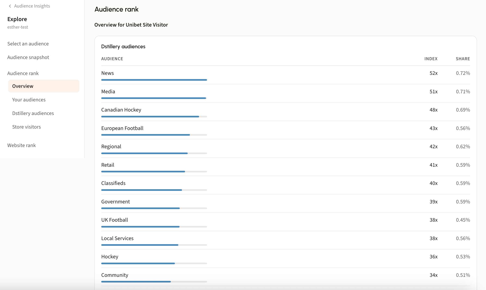<figcaption></figcaption></figure>

### Step 8. Carry the findings forward

When the profile tells you something worth acting on, take it into a build. Anything in the audience list can go live without leaving the report. **Activate Now** on a row carries that audience straight into the activation flow.

<figure>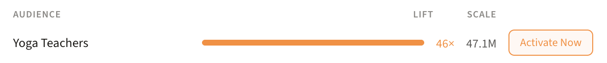<figcaption></figcaption></figure>

You can also attach a run to a project with **Add existing insights**, so everything that happens in that project has the insights as context.

<figure>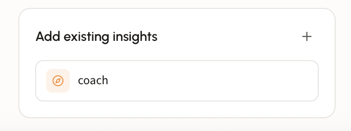<figcaption></figcaption></figure>

See [Work in projects](projects.md) for how project context is used.
